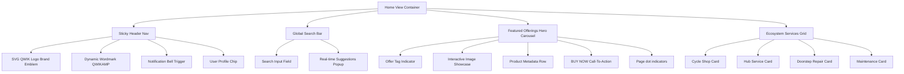

# QWIKAMP Home Page Design Specification

This document details the architectural layout, premium styling, component structure, and interactive design for the main **QWIKAMP Home Page** (EV cycle service & retail mobile application).

---

## 1. Visual Aesthetics & Design System

The home page layout is built to look alive, premium, and sleek. It seamlessly adapts between a clean slate light mode and a deep, atmospheric dark mode.

### Color Palette

| Token | Light Mode Value | Dark Mode Value | Semantic Role / Context |
| :--- | :--- | :--- | :--- |
| **Canvas Background** | `#F4F6F9` (Pristine Soft Slate) | `#0B0F17` (Deep Obsidian Void) | Main viewport backdrop |
| **Surface (Cards/Headers)** | `#FFFFFF` (Pure White) | `#161D2A` (Charcoal Surface) | Element blocks, sticky panels, modals |
| **Accent Primary** | `#CAEF00` (Electric Lime) | `#CAEF00` (Electric Lime) | Branding, priority call-to-actions, active indicators |
| **Contrast Text** | `#0B0F17` / `#0F172A` | `#F8FAFC` (Slate Ice) | Primary headings and interactive triggers |
| **Muted Text** | `#64748B` (Slate Gray) | `#94A3B8` (Muted Ice) | Body text, tags, captions |
| **Border / Rule** | `#E2E8F0` (Soft Border) | `#1E293B` / `#334155` | Dividers, element card boundaries |

### Typography

- **Headings & Badges**: Outfit / Inter (Heavy/Black weights, uppercase tracking, bold leading).
- **Body & Captions**: Inter / Roboto (Medium/Semi-bold weights, high line-height for readability).
- **Prices & Metas**: Monospace tracking (`font-mono`) for values, model numbers, and codes to feel precision-crafted.

---

## 2. Component Layout & Structure

The home page follows a single-scroll mobile view hierarchy optimized for thumbs:



---

## 3. Dynamic Components Specification

### A. Sticky Header Navigation
- **Emblem**: Contains the customized high-resolution vector `QWIK` emblem inside a sleek, bordered `rounded-xl` square.
- **Wordmark**: Uses tracking letters with the primary lime accent `#CAEF00` on the "AMP" segment.
- **Notification Bell**: Features an absolute-positioned neon-dot indicator. When tapped, it overlays a slide-in drawer showing real-time dispatch alerts (e.g., *Van #14 en route*).
- **Profile Chip**: Bordered thumbnail displaying the user avatar with a hover micro-scale.

### B. Intelligent Global Search
- Integrates a search input field with absolute left-aligned search icon.
- Tapping/typing triggers a backdrop-blur overlay that queries products and services in real-time, grouping them into categoric listings ("Cycle Products", "Ecosystem Services") with price tags and routing actions.

### C. Featured Offerings Carousel (Hero)
- **Auto-scroll**: Rotates automatically every 8 seconds, pausing if user focuses on the search bar or initiates manual navigation.
- **Visuals**: Displays products in high-contrast frames. Each slide shows:
  - Electric Lime offering tag (`tag` value).
  - Clean currency readout (`₹` values).
  - Integrated rating system and active hub tracking.
  - An interactive **BUY NOW** CTA using bold charcoal text on a high-contrast lime surface.

### D. Service Cards (Grid)
Four responsive service cards map key app gateways:
1. **Cycle Shop** (Glow color theme: `amber` | Icon: `ShoppingBag` | Action: `Cycle Shop` tab)
2. **Hub Service** (Glow color theme: `green` | Icon: `Wrench` | Action: `Repair` tab)
3. **Doorstep Care** (Glow color theme: `blue` | Icon: `Truck` | Action: `Repair doorstep` tab)
4. **Shield Coverage** (Glow color theme: `purple` | Icon: `Shield` | Action: `Repair warranty` tab)

*Visual Highlight*: Icon wrapper containers use a HSL custom-light tint backdrop (`colorTheme/10`) with matching colored glow box-shadows.

---

## 4. Animation & Interaction Specifications

All movements on the Home Page are governed by smooth, spring-based transitions to look responsive and fluid.

```javascript
// Motion Transitions Configuration
const transitions = {
  carouselFade: { duration: 0.35, ease: "easeInOut" },
  cardTap: { scale: 0.98, transition: { duration: 0.1 } },
  overlaySlide: {
    initial: { opacity: 0, y: -10 },
    animate: { opacity: 1, y: 0 },
    exit: { opacity: 0, y: -10 },
    transition: { type: "spring", stiffness: 300, damping: 25 }
  }
};
```

### Micro-interactions Checklist:
- [ ] **Glow hover**: Swhovering on service cards scales the glowing icon box by 5%.
- [ ] **Drawer transition**: Notification toggle slides the pane down from below the navbar with a subtle spring rebound.
- [ ] **Pagination dots**: Tapping page indicators scales the dot width dynamically (`w-1.5` -> `w-4`).
- [ ] **Search clearance**: Clearing the query collapses the search results suggestion modal using scale transitions.
